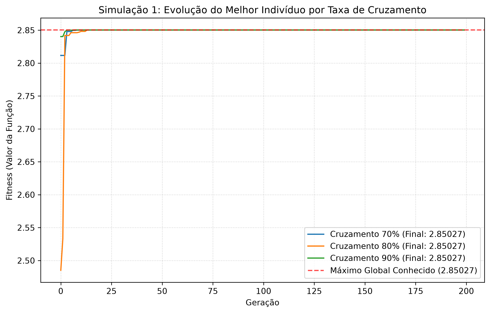
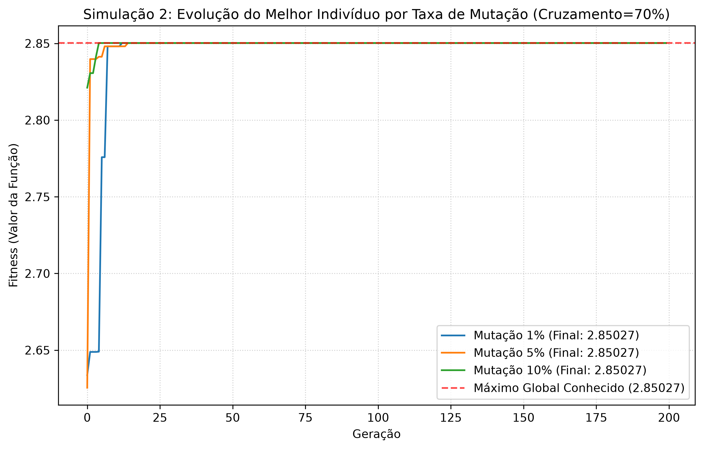

# Algoritmo Genético do Zero em Python

Este projeto consiste na implementação de um **Algoritmo Genético (AG) desenvolvido completamente do zero** (sem o uso de bibliotecas de terceiros para a lógica evolucionária), com o objetivo de maximizar a função matemática:

$$f(x) = x \cdot \operatorname{sen}(10\pi x) + 1$$

no intervalo $x \in [-1, 2]$.

O problema possui um ponto ótimo global conhecido em $x \approx 1{,}85055$ onde a função assume o valor máximo de $f(x) \approx 2{,}85027$.

---

## 🛠️ Parâmetros do Algoritmo

- **Tamanho da População:** 100 indivíduos
- **Critério de Parada:** 200 gerações
- **Representação do Cromossomo:** Cadeia binária de tamanho fixo com **22 bits** (garantindo precisão de pelo menos 6 casas decimais)
- **Função de Fitness:** A própria função objetivo $f(x)$ (com ajuste de *shift* dinâmico para lidar com valores negativos na roleta)
- **Método de Seleção:** Roleta combinada com Elitismo de 10%
- **Operador de Cruzamento:** Cruzamento de um ponto
- **Operador de Mutação:** Mutação simples (bit-flip) por probabilidade independente em cada bit

---

## 📂 Estrutura do Projeto

A lógica foi modularizada em três arquivos principais seguindo boas práticas de design de software:

1. **[individuo.py](individuo.py):** Representação do cromossomo binário, decodificação para valor real ($x$) e avaliação do fitness.
2. **[ag.py](ag.py):** Motor do Algoritmo Genético (geração da população inicial, cálculo de probabilidades por roleta com correção matemática para fitness negativos, operadores genéticos de crossover e mutação, e loop de gerações com elitismo).
3. **[main.py](main.py):** Script de automação das simulações, coleta de estatísticas e plotagem dos gráficos de convergência.

---

## 🚀 Como Executar

Certifique-se de ter o Python 3.x instalado e a biblioteca `matplotlib` (utilizada apenas para gerar e salvar os gráficos).

1. Instale o matplotlib (se necessário):
   ```bash
   pip install matplotlib
   ```

2. Execute as simulações:
   ```bash
   python main.py
   ```

O script rodará as duas simulações descritas no escopo do projeto, imprimindo o progresso e salvando os gráficos comparativos diretamente na pasta raiz.

---

## 📊 Provas de Funcionamento (Resultados das Simulações)

As simulações a seguir servem como prova da eficácia do algoritmo desenvolvido. Ambas convergem consistentemente para valores extremamente próximos ao ótimo teórico global ($2{,}85027$).

### Simulação 1: Variação da Taxa de Cruzamento

Neste experimento, fixou-se a taxa de mutação em 1% e o elitismo em 10%, variando-se a taxa de cruzamento em **70%**, **80%** e **90%**:



A simulação demonstra que mesmo variando a taxa de cruzamento, o algoritmo consegue convergir rapidamente (antes da geração 75) para o patamar do ótimo global. A taxa de **70%** obteve o melhor indivíduo final.

### Simulação 2: Variação da Taxa de Mutação

Neste experimento, fixou-se o elitismo em 10% e o cruzamento em 70% (a melhor taxa da etapa anterior), variando-se a taxa de mutação em **1%**, **5%** e **10%**:



O gráfico evidencia o papel das diferentes taxas de mutação. A mutação de **1%** apresenta uma curva de convergência mais estável e suave. Taxas de mutação de **5%** e **10%** geram mais oscilação no processo evolutivo geral da população devido à perturbação constante do material genético, mas o **elitismo de 10%** impede que o melhor indivíduo seja degradado, garantindo o alcance e a preservação do máximo global.
